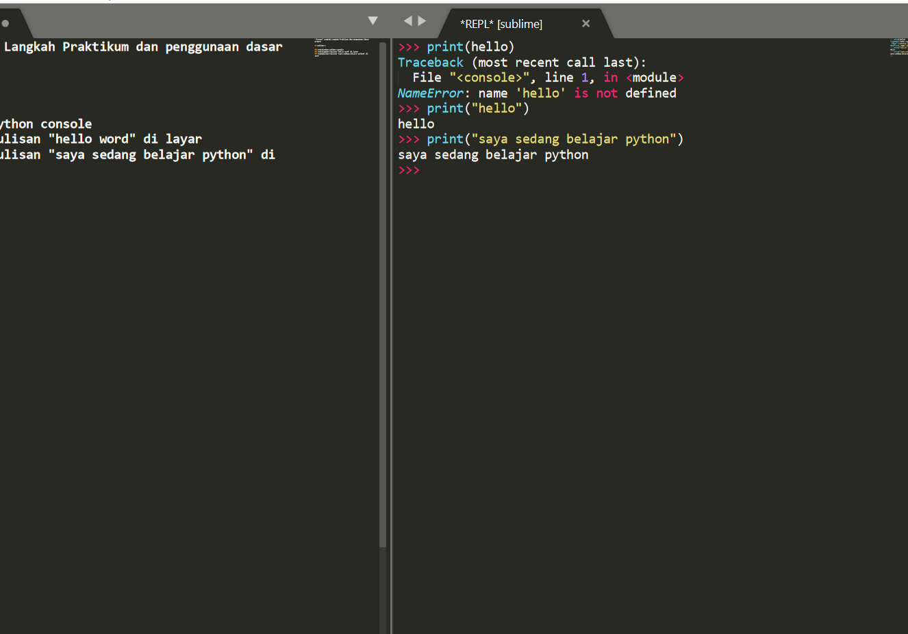

# Proses/ Langkah Langkah Praktikum dan penggunaan dasar pycharm

## Latihan 1

### menjalankan python console
### menjalankan tulisan "hello word" di layar
### menampilkan tulisan "saya sedang belajar python" di layar

